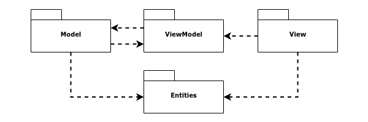
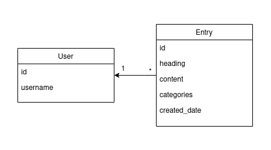
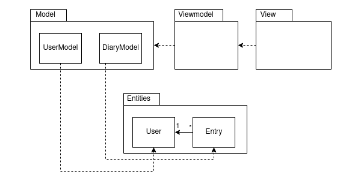
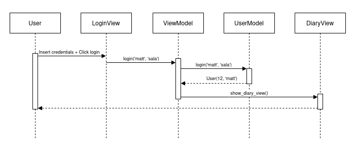
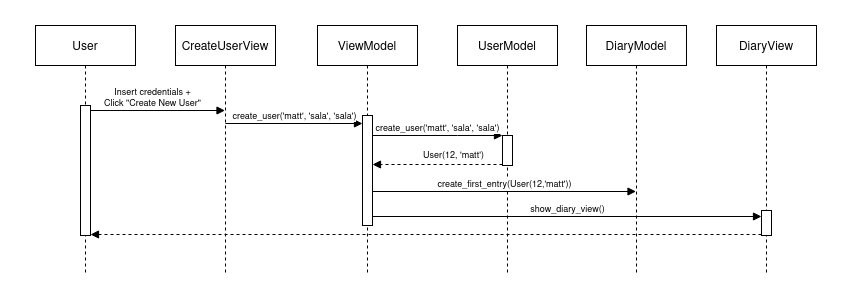

# Architecture description

## Structure

Structure of the program follows [Model-View-ViewModel (MVVM)](https://en.wikipedia.org/wiki/Model%E2%80%93view%E2%80%93viewmodel), or a [Three-tier](https://en.wikipedia.org/wiki/Multitier_architecture#Three-tier_architecture) architecture. Packaging structure of the code is following:

Package _View_ contains the views, the UI. _ViewModel_ handles the drawing of correct views based on events from user and responses from the Model. _Model_ handles the business logic and the database actions. _Entities_ contains classes created for the application.

## Views

User interface contains four views:

- Login
- Create new user
- List diary entries
- Editing an entry

Each of the views are separate classes and only a single view is rendered at the time. [ViewModel](../src/viewmodel/view_model.py) class shows and hides each view. UI is mostly separated from the rest of the application.

Each view has only a handful of possible actions. ViewModel supplies these actions and necessary data for the view to render. After user input, the view is either changed to another view, or error message is shown.

## Application logic

Logical classes used in the application are [User](../src/entities/user.py) and [Entry](../src/entities/entry.py). They reconstruct the real-world-like scenario, where a user can add an entry to his/her/its diary or journal. Data structure of the classes are as follows:

ViewModel controls the actions and responses that are handled when the application is running. ViewModel feeds the views with following functions from the [UserModel](../src/model/user_model.py) and  [DiaryModel](../src/model/diary_model.py):

- `login(username: str, password: str)`
- `create_user(username: str, password_1: str, password_2: str)`
- `save_entry(entry: Entry)`

Following class and package structure visualizes the relation:

## Data storage

UserModel and DiaryModel are responsible to connect SQLite database for retrieving information and storaging data.

### Files

The application storages user information and diary entries in same database (pydiary.db). User and diary data are stored in individual tables. [database.py](../src/database.py) initializes the database, if suitable file is not found.

## Main functionalities

### Login

Succesful login requires inputting username and password of already created user. After clicking the 'Login' -button, following sequence of events occurs.

`ViewModel` injects `login()` function to `LoginView`. Function `login()` is called with inputted variables, username and password. `ViewModel` function `login()` calls `UserModel` function `login()`, that validates username and password combination from database.

- If succesful, `UserModel` returns `User` entity to `ViewModel`. `ViewModel` then renders `DiaryView` with logged in user information
- If unsuccesful, `UserModel` raises Exception. `ViewModel` then renders `LoginView` with suitable error message

### Create user

Succesful creation of new user requires following conditions:

- username is over 2 characters long
- username is unique within local database
- password is over 2 characters long
- password inputs match

`ViewModel` injects `create_user()` function to `CreateUserView`. Function `create_user()` is called with inputted variables, username, password and password again. `ViewModel` function `create_user()` calls `UserModel` function `create_user()`, that validates username and passwords, and creates new user to database.
`ViewModel` also creates new entry for new user by calling `DiaryModel` function `create_first_entry()`. First entry is also inserted in database for new user.

- If succesful, `UserModel` returns `User` entity to `ViewModel`. `ViewModel` then renders `DiaryView` with logged in user information
- If unsuccesful, `UserModel` raises Exception. `ViewModel` then renders `CreateUserView` with suitable error message
