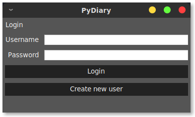
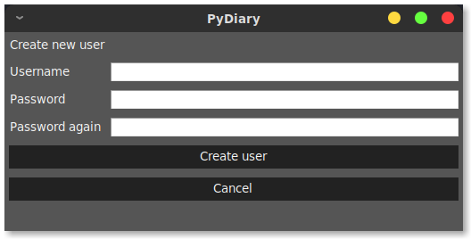

# Instructions for use

## Download and extract

Download [the latest release](https://github.com/tuukkalai/ot-harjoitustyo/releases/latest) from [Releases page](https://github.com/tuukkalai/ot-harjoitustyo/releases).

After downloading, extract the contents to desired directory and open terminal in selected directory.

## Run the application

> Prerequisites: Python 3.8 or higher and [Poetry](https://python-poetry.org/)

Install dependencies

```sh
poetry install
```

Start the application

```sh
poetry run invoke start
```

## Log in

Starting the application opens Login View



Logging in can be done by inputting username and password to their input boxes, and by clicking `Login`

## Create new User

To log in, a user must be created. New user can be created by clicking `Create new user` from Login View.

Create new user view:



Insert username and password for corresponding input boxes and click `Create user`.

The application shows an error, if username or password is invalid.
