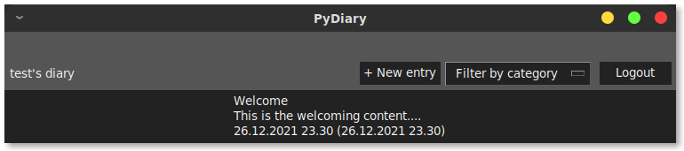
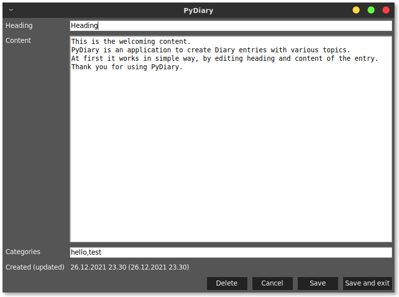

# Instructions for use

## Download and extract

Download [the latest release](https://github.com/tuukkalai/ot-harjoitustyo/releases/latest) from [Releases page](https://github.com/tuukkalai/ot-harjoitustyo/releases).

After downloading, extract the contents to desired directory and open terminal in selected directory.

## Run the application

> Prerequisites: Python 3.8 or higher and [Poetry](https://python-poetry.org/)

Install dependencies

```sh
poetry install
```

Start the application

```sh
poetry run invoke start
```

## Log in

Starting the application opens Login View


Logging in can be done by inputting username and password to their input boxes, and by clicking `Login`

## Create new User

To log in, a user must be created. New user can be created by clicking `Create new user` from Login View.

Create new user view:


Insert username and password for corresponding input boxes and click `Create user`.

The application shows an error, if username or password is invalid.

## Edit an Entry

List of entries are visible to logged in user. If no entries are listed, click `+ New entry`. New entry will be added to the bottom of the entries list.

Edit an Entry by clicking it.



Entries consists on heading, content and categories. Heading and content are simple text fields. Categories are separated by comma (`,`).

Dates in Diary View and under categories in Edit View are generated automatically. They inform when the Entry was created and last updated.



Save entry by clicking `Save` or `Save and exit`. To discard changes in Entry, click `Cancel`. To delete the Entry, click `Delete`.
